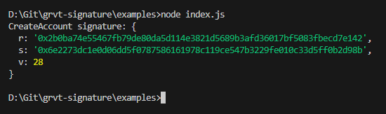

# GRVT SIGN EXAMPLES

## Getting Started

### Install dependencies

```bash
npm install
```

### Private key

Open [`index.js`](index.js#L5) and replace the `PRIVATE_KEY` variable with your private key.

## Execute sign script

```bash
# use scripts
npm run start
# use node
node index.js
```

## Expected output


